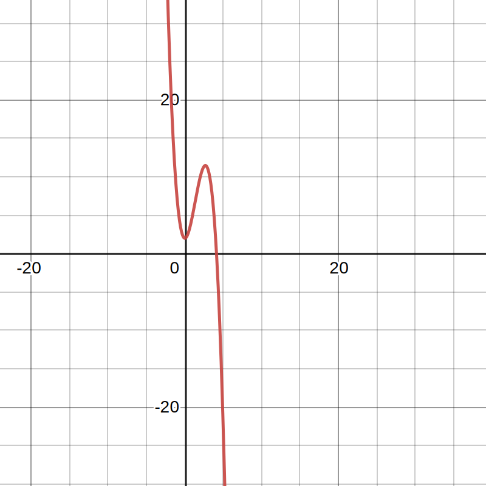
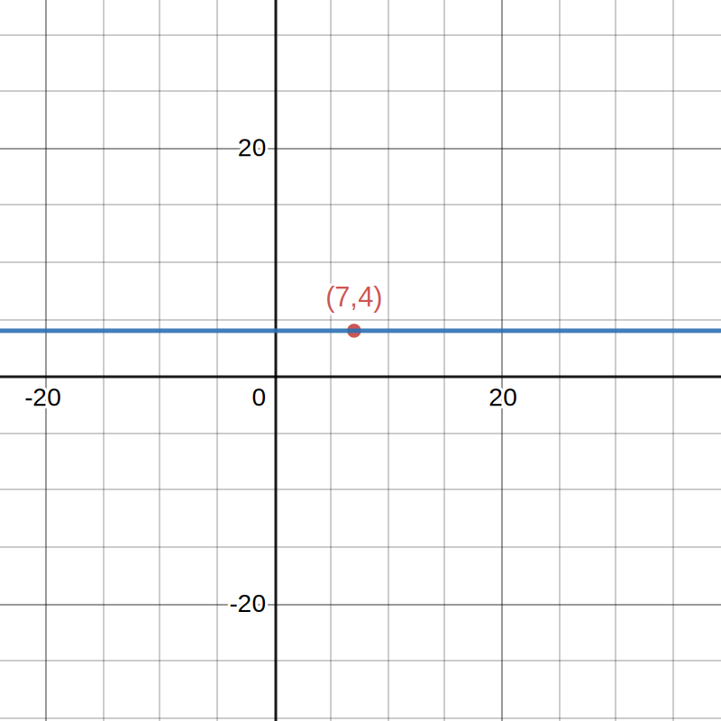
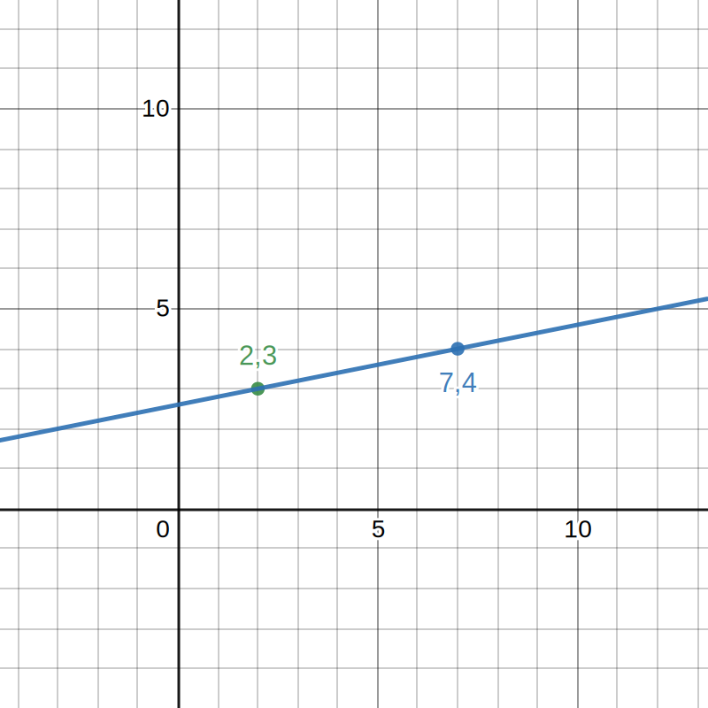

# Polynomial
___

## Definition

A single variable *polynomial* with real coefficients is a function f that
takes a real number as input, produces a real number as output, and has form:

```
f(x) = a0 + a1 * x + a2 * x^2 + ... + an * x^n
```

where the ai are real numbers. The ai are called coefficients of f. The degree of the polynomial is the integer n.

## Examples

### Implications

Some parts of the equation can be implied

```
3 * x^2 + x - 5 = 3 * x^2 + 1 * x^1 -5 * x^0
```

### Calculation

```
x = 2
a0 = 2
a1 = 0
a2 = 4
a3 = -1

f(x) = a0 + a1 * x + a2 * x^2 + a3 * x^3
f(2) = 2 + 0 + 4 * 4 + -1 * 2^3
f(2) = 10
```



### Exercise

Determine for each function if is or is not a polynomial.

```
f(x) = 0                                - is polynomial (zero polynomial)
g(x) = 12                               - is polynomial (monomial)
h(x) = 1 + x + x^2 + x^3                - is polynomial
i(x) = x^1/2                            - is not polynomial (power should be an integer)
j(x) = 1/2 + x^2 - 2x^4 + 8x^8          - is polynomial
k(x) = 4.5 + 1/x - 5/x^2                - is not polynomial (power should be an positive integer)
l(x) = 3.14 - 1/e * x^5 + e*3.14*x^10   - is polynomial
m(x) = x + x^2 - x^3.14 + x^e           - is not polynomial (power should be an integer)
```

## Introduction to notation
TD: make separate section for notation

### Function

- Inputs (A) are called domain.
- Set of possible outputs (B) are called range and the type of outputs are called codomain.

```
f : A → B
```

In output (range) of this specific function cannot be number 3.

```ts
function f (x: int): int {
  return 2 * x
}
```

Domain and codomain are defined by notation (interface), while the output (range) depends on the semantics (implementation) of the function.

### Symbols

- ℝ = set of real numbers
  ℝ² = pairs of real numbers
- ℤ = integers
- ℕ = positive integers (natural numbers)
- ∈ = assume membership in some set (`q ∈ ℕ` clams that q is a natural number)

## Existence & Uniqueness

Existence proof determines whether the equation has a solution.
Uniqueness determines whether the equation has one or more solutions.

## Theorem

For any integer n ≥ 0 and any list of n + 1 points (x₁,y₁), (x₂,y₂), ...,(xₙ₊₁,yₙ₊₁) in ℝ² with x₁ < x₂ < ... xₙ₊₁, there
exists a unique polynomial p(x) of degree at most n such that p(xᵢ) = yᵢ for all i.

**A briefer version:**

There is a unique degree n polynomial passing through a choice of n + 1 points.

**Examples**
```
n = 0, n + 1 = 1
random point = (7, 4)
f(x) = a0
f(7) = 4
```


```
n = 1, n + 1 = 2
random points = (2, 3), (7, 4)
f(2) = 3
f(7) = 4

f(2) = a0 + a1 * x
f(7) = a0 + a1 * x

a0 + a1 * x = 3
a0 + a1 * x = 4

a0 + a1 * 2 = 3
a0 + a1 * 7 = 4

a0 + a1 * 2 = 3
a0 = 3 - a1 * 2

3 - a1 * 2 + a1 * 7 = 4
a1 = 1 / 5

f(x) = a0 + a1 * x
a0 = 3 - 1/5 * 2
a1 = 1 / 5
```

